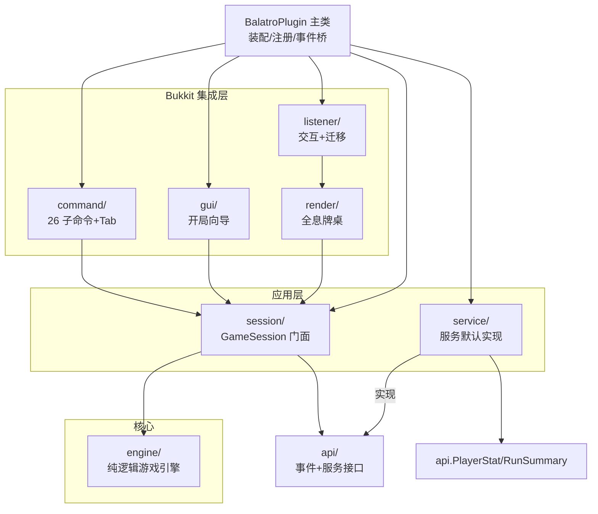

# 01 — 项目架构分析

> 代码基线 v0.4.60（2026-08-17）。所有行号引用相对 `src/main/java/cn/quotidietium/balatro/`（除特别标注）。

## 1. 总体架构：严格单向分层

项目采用**六边形思想下的 pragrmatic 分层**：核心领域（engine）零框架依赖，Bukkit 集成层
作为外环适配器，api 包构成对外稳定端口。依赖方向严格单向：



**依赖规则（代码可验证）**：

| 规则 | 证据 |
|---|---|
| `engine/` 零 Bukkit import | 21 个引擎文件无一处 `org.bukkit` 引用（5 通道通读确认） |
| engine 通过 SPI 上抛纯逻辑事件 | `RunState.msg/drainMessages`（RunState.java:221-233）消息队列；钩子接口 Joker.java |
| render/listener/command 只经 session 读写状态 | RoundBoard 持 GameSession 引用（RoundBoard.java:122）；BoardListener.dispatch 全部调 session/board 方法（BoardListener.java:96-160） |
| api/ 不依赖 engine 内部 | api 包仅引用自身 PlayerStat/RunSummary 与 Bukkit Event 基类 |
| 第三方扩展只挂 api | 5 事件 + 5 服务接口（API.md），无需 fork |

## 2. 包结构全景（60 文件）

| 包 | 文件数 | 职责 | 代表文件（行数） |
|---|---|---|---|
| 根 | 1 | 主类：装配/注册/清扫/事件桥 | BalatroPlugin.java（182） |
| `engine/` | 16 | 纯逻辑引擎核心：状态机/计分/构建 | Engine.java（1294）、RunState.java（581）、Data.java（650）、HandEval.java（264）、Rng.java（254）、Card.java（215）、ChallengeMods.java（162）、ScoreContext.java（117）、PlayHandInfo.java（77）、Mods.java（73）、StreamSource.java（69）、JokerInstance.java（25）、Phase.java（10）等 |
| `engine/joker/` | 2 | 150 小丑定义 + 注册表 | BasicJoker.java（1351，枚举常量特化）、JokerRegistry.java（119） |
| `engine/consumable/` | 1 | 52 消耗品使用/目标解析 | Consumables.java（421） |
| `engine/shop/` | 2 | 商店生成交易 + 补充包 | Shop.java（540）、Packs.java（178） |
| `api/` | 2 + 5 + 5 | 数据 record / 事件 / 服务接口 | RunSummary、PlayerStat；Balatro*Event ×5；5 个服务接口 |
| `service/` | 9 | 服务默认与可替换实现 | FileStats（174）、VaultEconomy（114）、Services（102）、MemoryLeaderboard（100）、FileWinCounter（101）、EconomyReward（53）、MemoryStats（32）、NoOpEconomy（25）、NoOpReward（21） |
| `session/` | 3 | 会话门面 + 注册表 + 退出清理 | GameSession.java（371）、SessionManager.java（109）、SessionListener.java（23） |
| `render/` | 2 | 全息牌桌 + 实体工厂 | RoundBoard.java（1144）、Holo.java（73） |
| `listener/` | 2 | 交互入口 + 迁移 | BoardListener.java（199）、BoardMoveListener.java（67） |
| `command/` | 4 | 命令执行/帮助/悬停/版本 | BalatroCommand.java（833）、BalatroHelp.java（320）、HoverText.java（78）、VersionInfo.java（27） |
| `gui/` | 6 | 开局向导 | GuiManager.java（598）、GuiItems（122）、GuiState（111）、GuiLayout（58）、GuiHolder（32）、MenuType（15） |

资源文件：`plugin.yml`（20 行，softdepend Vault，aliases blt/joker）、`config.yml`
（15 行，reward.economy.*）、`jokermeta.txt`（150 条小丑元数据）、`challengemods.txt`
（20 挑战定义块）。

## 3. 引擎层内部架构

### 3.1 静态门面 + 可变状态对象

- **Engine** 是静态工具类（私有构造，Engine.java:41-42），全部方法 `static`，操作传入的
  `RunState`；无单例、无全局状态——这是多会话交错确定性（MultiSessionInterleaveTest）
  的结构前提。
- **RunState**（public 字段风格对齐 JS state，RunState.java:14-18）按域分组：
  配置（seed/deckKey/stakeIdx/challenge:22-25）→ 进度（money/ante/phase/won/lost:29-39）
  → 槽位上限（jokerSlots…shopSlots:42-52）→ 可变游戏集合（jokers/consumables/vouchers/
  tags:55-58；fullDeck/drawPile/hand/discardPile:61-66）→ 牌型升级与统计（handLevels/
  handPlayedCount/usedPlanets:69-73）→ 回合运行时（handsLeft/roundScore/flags:76-88）
  → Boss 运行时（129-134）→ 商店/包（148-152）→ 流缓存与私有（155-157）。

### 3.2 内容定义体系：三层结构

```
Data.java（静态表：13 类枚举/record，Data.java:27-649）
   ↓ JokerRegistry.register / Data.BY_KEY
Joker 接口（钩子 default 空实现，Joker.java:13-134）+ BasicJoker 枚举（150 常量特化）
   ↓ create(key)
JokerInstance（运行时实例：def 引用 + debuff/edition/extra 累积/贴纸，JokerInstance.java:7-24）
```

- 定义无状态（享元），状态在实例——多副本同 key 小丑 extra 独立（R111 修复的三参
  onPlayHand 重载即为此，Joker.java:44-52）。
- `JokerRegistry.BY_KEY` 为 **ConcurrentHashMap**（公开 register API 的并发加固，
  JokerRegistry.java:25-28）；元数据 jokermeta.txt 单行损坏仅跳过、整表异常降级
  （JokerRegistry.java:102-117）。
- 复制类（蓝图/头脑风暴）经 `Engine.resolveCopy`（Engine.java:966-979）在计分时解析
  实际生效实例。

### 3.3 随机体系：命名流 + 惰性缓存 + 一次性流

- **Rng**：FNV-1a 种子哈希（Rng.java:26-33）+ mulberry32（Rng.java:187-193）；
  流 API：next/range/pick/chance/shuffle/weighted（Rng.java:179-253）。
- **StreamSource**（StreamSource.java:6-13）：`stream(name)` 惰性 get/put，同一名=同一条
  流连续推进；前缀态 `prefixHash` 一次计算（P11 折叠建流，免字符串拼接）。
- **三类一次性流**绕过缓存（名字内嵌严格递增序号永不复现，StreamSource.java:43-60）：
  `streamUse`（"use:"+key，消耗品）、`streamRound`（shuffle/shopgen 每回合）、
  `streamPack`（pack+序号）。
- 唯一非复现随机是 `randomSeedString`（ThreadLocalRandom，显式标注，Rng.java:35-45）。

### 3.4 计分管线（playHand，Engine.java:601-925）

函数级调用链（主干，行号为 Engine.java）：

```
playHand(s, cardIds) :601
├─ 守卫链 :602-643（阶段/出牌数/查重 O(n²)/Boss 限制 psychic·must5·bell）
├─ HandEval.evaluate(s, cards) :635 ──→ 13 牌型 + 计分牌 + contains 集合
├─ 基础分：handLevel 等级加成 :649-652；flint Boss 减半 :655-660
├─ ScoreContext 构造 :668-670；activeJokers 池化快照过滤 :672-677
│    （heart Boss 随机禁用 :680-685；计分前钩子 space/obelisk :690-710）
├─ ① 逐张计分 :713-752
│    ├─ scoreOneCard :731→930（石头+50/点数/增强 bonus·mult·glass·lucky/版本/金蜡封）
│    ├─ 重触发：红蜡封 +721 + Joker.retrigger :722-728（经 resolveCopy）
│    ├─ Joker.onScoreCard :732-738
│    └─ 玻璃破碎 stream("glass") :741-751 → setBroken + onGlassBreak
├─ ② 持有牌 :756-770（哑剧/红蜡封重触发、钢铁 ×1.5、Joker.onHeld）
├─ ③ 独立小丑 :773-777 → applyJokerScore :981（resolveCopy+onScore+版本加成）
├─ observatory 星球 ×1.5 :780-788；等离子平衡 :795-799；chipsCapByMoney :802-804
├─ score=round(chips×mult) :806-808；roundScore=satAdd :811
├─ 后处理 :814-851（计数器/Boss ox·tooth·arm/出牌离手/破碎销毁 removeCardFromDeck）
├─ Joker.onPlayHand（快照分发，PlayHandInfo）:854-865
├─ hook Boss 强弃 :872-900（紫蜡封产塔罗/onDiscard）
├─ drawUpTo :902→526（wheel/xray 面朝下、mark/pillar/花色失效）
└─ 胜负判定 :907-925（达标→endRound:909；耗尽→骨头先生免死:914-923 或 loseRun:924）
```

### 3.5 商店/包/消耗品

- **Shop**（Shop.java）：`openShop:141-144` 置 SHOP + `genShop:157-232`
  （streamRound("shopgen") 一次性流；权重表平置 int[] :240-258）；`buyCard:449-478` /
  `buyPack:480-490` / `buyVoucher:493-509` / `reroll:511-534`；`makeJokerItem:376-427`
  （稀有度 70/25/5、贴纸概率、租赁 $1）。静态共享池（P9）：SHOP_PACK_POOL/
  SHOP_SPECTRAL_POOL/JOKERS_BY_RARITY（Shop.java:22-62）。
- **Packs**（Packs.java）：`open:37-58`（packReturn 支持嵌套包）、`genPackCard:60-122`
  （五类包各自生成规则）、`pick:125-157` / `skip:160-176`。
- **Consumables**（Consumables.java）：`use:33-75`（校验→apply→移除→fool 记录→
  onUseTarot/onUsePlanet→sortHand+recomputeFlags）；`targets:93-112`（max/exact 边界）；
  `apply:125-380`（塔罗 22 + 幻灵 18 分支，一次性流 streamUse）。

## 4. 渲染层架构

### 4.1 双实体模型 + 命令编码

每张可点元素 = **1 TextDisplay（视觉）+ 1 Interaction（命中盒）**。动作编码进 scoreboard
tag `balatro_i_<action>`（RoundBoard.java:280-295）；参数化动作如 `card:3`/`shop:2`/
`joker:1`。视觉-命中对齐：文字自实体向上生长，故牌面下移 CARD_HH=0.55 对齐命中中心
（RoundBoard.java:431-433）。

### 4.2 实体池 + 差量更新（无闪烁）

- Interaction 池：`List<Interaction>` + 游标复用，不足才新建（RoundBoard.java:151-152,
  280-295）；本帧多余实体置零尺寸并去 tag（hideExtraInteractions，:297-305）。
- TextDisplay 槽位池：手牌/小丑/消耗品/商品/包/券六组懒增长列表（:138-143, 313-331）。
- `update(state)`（:225-274）每次原地改写不 clear+respawn；阶段切换先 hideAll；finally
  保证清理 + 失败回滚 activePhase 下帧完整重建（:216-223, 260-268）。

### 4.3 自愈与迁移

- 自愈：update 开头全量扫描 hasInvalidEntity（约 50 实体，跨区块半死检测）→ relocate
  整体重建（:226-238）；selfHealing 标志防重入。
- 迁移：BoardMoveListener 只监听 Teleport（>64 格或跨世界）与 Respawn，1 tick 延迟后
  relocate；relocate 保留 selected 选中集（RoundBoard.java:181-187）。

## 5. 会话与命令架构

- **SessionManager**：`HashMap<UUID,GameSession>`（SessionManager.java:16，仅主线程约定）；
  start 五重防线（已有局/种子兜底/构造异常/RunStart 取消/putIfAbsent 防递归重入，
  :28-60）；endIfCurrent 引用身份比较防误杀新局（:92-96）。
- **GameSession** 门面：全部动作 = 引擎静态函数改 state → board.update(state) 重绘；
  关键节点发事件+调服务（play 的编排见 02 报告）。
- **BalatroCommand**：26 子命令分发（dispatch :86-114）；权限 balatro.play 实施
  （:63-66）+ Tab 无权返回空（:803-805）；TOCTOU 期望身份校验（use/sellj/sellc 三处，
  :579-592/660-666/682-688）；cmdTop 1s 节流+惰性清扫+降级（:703-723）。
- **GUI 向导**：MenuType 五态流转（MAIN→DECK→STAKE→(CHALLENGE)→CONFIRM，
  GuiManager.dispatchClick :394-464）；GuiHolder 标记防伪；pendingSeeds
  ConcurrentHashMap 原子认领 60s 种子聊天窗口（:76-79, 513-542）；开/关/开局均延 1 tick。

## 6. API 与服务架构

- **5 事件**（全部 final 字段，仅 RunStart 可取消）：字段契约见 API.md 与
  api/event/*.java；触发点在 GameSession（见 02 报告）。
- **5 服务接口 + 装配**（Services.java）：5 个 volatile 字段（:24-28）；setter 一律
  null 拒绝；三向重绑（setStats/setWinCounter/setLeaderboard 互相同步注入，
  :56-100）防排行榜读旧源。
- **默认/可替换矩阵**：Economy→NoOp/VaultEconomy（反射适配，四方法全成功才可用，
  VaultEconomy.java:34-50）；Stats→Memory/FileStats；Reward→NoOp/EconomyReward
  （Supplier 现取经济，≤0 档不发，EconomyReward.java:44-51）；Leaderboard→MemoryLeaderboard；
  WinCounter→FileWinCounter。

## 7. 设计模式总清单

| 模式 | 位置（代表） |
|---|---|
| 钩子/观察者（多播） | Joker 接口 23 钩子（Joker.java:13-134）；引擎各分发点快照迭代 |
| 注册表+工厂 | JokerRegistry（:28-77）；BalatroHelp PAGES/COMMANDS（:18-275） |
| 策略 | reflow 按 Phase 分派（RoundBoard.java:253-258）；Mods 标志袋（Mods.java:8） |
| 门面 | GameSession（类注释 :20-25） |
| 服务定位器 | Services（:24-43） |
| 标记 Holder | GuiHolder（:6-32） |
| 对象池 | Interaction 池/槽位池（RoundBoard）；Joker 快照深度分层池（RunState.java:90-128） |
| 享元/静态共享池 | BasicJoker 枚举定义；Shop 静态池（Shop.java:22-62）；Data 枚举缓存列表（:27-32） |
| 位打包 | Card 22bit（Card.java:26-33）+ 位段谓词（:105-117） |
| ThreadLocal 草稿区 | HandEval.SCRATCH（HandEval.java:31-42） |
| 双缓冲 | flagsSpare（Engine.java:375-382）；drawPile 复用（:469-473） |
| 命令模式（tag 编码） | balatro_i_<action>（Holo.java:65；RoundBoard.java:280-295） |
| 两步确认（TOCTOU 令牌） | confirmButtons + 期望 key（RoundBoard.java:1036-1111） |
| 原子认领 | pendingSeeds.remove（GuiManager.java:525） |
| 防腐层/故障隔离 | fire* 桥（BalatroPlugin.java:128-177）；safeService（GameSession.java:308-314） |
| 备忘录式重建 | relocate 保留 selected（RoundBoard.java:181-187） |
| 静态工厂 | Holo（:17-19）；PlayResult err/ok/okDiscard（Engine.java:1282-1292） |

## 8. 技术栈与构建

- `build.gradle.kts`：version 0.4.60（:6）；paper-api compileOnly（:15）；JUnit 5 BOM
  5.11.4 + adventure 序列化器进测试类路径（:17-25）；UTF-8 + `--release 21`（:29-32）；
  processResources 对 plugin.yml `expand("version")`（:38-45）。
- `settings.gradle.kts`：rootProject "balatro" + include("benchmark")。
- `gradle.properties`：`org.gradle.java.home=F:/Java/21`（机器相关）。
- 产物 `balatro-0.4.60.jar`；版本号全库唯一源 = build.gradle.kts:6。

## 9. 架构级观察

1. **静态门面风格的代价与收益**：Engine/Shop/Packs/Consumables 全静态方法+显式传
   RunState，牺牲 OO 封装换取零隐藏状态——直接支撑多会话交错确定性与全量单测。
2. **RunState 是唯一的"上帝对象"**（581 行 public 字段），但其写面被规范入口收口
   （gainMoney/gainJoker/addConsumableKey/removeCardFromDeck 等，见 02 报告），写面
   普查五域闭合（note 审计方法学不变量 9）。
3. **遗留标记**：`balatro_card_<id>`/`balatro_act_*` tag 已无消费方（RoundBoard.java:39,
   327-330 注释）——架构演进残留，可清理项。
4. **注释漂移两处**（不影响行为）：RunState.java:25/31 的 0.1.0 期注释与现状不符
   （challenge 与 Boss 均已生效）。
5. **渲染命中机制已从"射线检测"演进为 Interaction 实体**（RoundBoard.java:36-38 注释），
   README/计划书中的 raycast 表述为历史口径。
