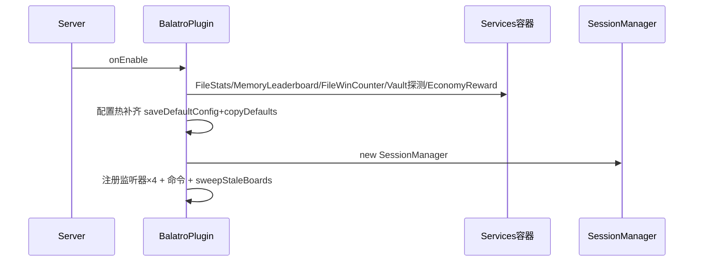
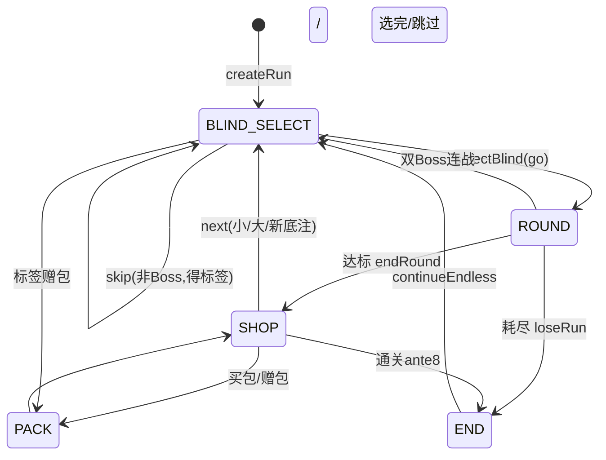
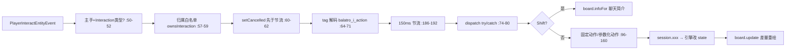

# 02 — 项目运行原理

> 代码基线 v0.4.60（2026-08-17）。行号引用相对 `src/main/java/cn/quotidietium/balatro/`（除特别标注）。
> 本报告回答：插件怎么启动、一局怎么流转、出牌怎么计分、数据怎么持久化、错误怎么被隔离。

## 1. 启动流程（onEnable 装配序列）

`BalatroPlugin.onEnable()`（BalatroPlugin.java:32-77）按以下**精确顺序**执行：

| 步 | 动作 | 行号 | 失败语义 |
|---|---|---|---|
| 1 | `new Services()` 服务容器 | :33 | — |
| 2 | `setStats(FileStats(stats.txt))` | :35-36 | IO 失败从空记录开始（FileStats.java:105-108） |
| 3 | `setLeaderboard(MemoryLeaderboard(stats))` | :37 | — |
| 4 | `setWinCounter(FileWinCounter(wins.txt))` | :39-40 | 同上 |
| 5 | Vault 探测：isPluginEnabled→new VaultEconomy→available 才 setEconomy+日志 | :41-47 | 不可用静默保持 NoOp |
| 6 | 配置三连：saveDefaultConfig→copyDefaults(true)→saveConfig（热补齐） | :50-52 | — |
| 7 | reward.economy.enabled(默认 true)→装配 EconomyReward(1/10/100) | :53-59 | false 回落 NoOpReward |
| 8 | `new SessionManager(this)` | :60 | — |
| 9 | `new GuiManager(this)` | :61 | — |
| 10 | `new BalatroCommand(this)` | :63 | — |
| 11 | 注册 4 监听器：SessionListener→BoardListener→BoardMoveListener→guiManager | :64-67 | — |
| 12 | 命令注册：getCommand 非空才 setExecutor+setTabCompleter | :68-72 | — |
| 13 | `sweepStaleBoards()` 清残留全息实体 | :74 | 异常记 warning 提前返回（:94-100） |
| 14 | 版本启用日志 | :76 | — |



**onDisable**（:104-113）：先 `guiManager.closeAll()`（先关菜单防关停后背包停留插件
界面，:106 注释）→ `sessionManager.shutdownAll()`（逐一 despawnBoard，个别失败忽略，
SessionManager.java:99-108）→ 日志。

**残留清扫**：所有全息实体带 scoreboard tag `balatro_board` 且 `setPersistent(false)`
（Holo.java:26-27, 64）；sweepStaleBoards 遍历全世界实体删除带 tag 者——双保险应对
/reload 与异常泄漏（BalatroPlugin.java:79-92）。

## 2. 一局的生命周期

### 2.1 开局链（命令路径）

```
玩家 /balatro play [牌组] [赌注] [挑战] [种子]
└─ BalatroCommand.cmdPlay :136-171（参数顺序不限自动识别：赌注→牌组→挑战→种子）
   ├─ Rng.isValidSeed 校验（:149-152；规则：长度1-32、[A-Za-z0-9_-]，Rng.java:57-66）
   └─ SessionManager.start :28-60
      ├─ 已有局→null :30；种子兜底再校验 :32-35
      ├─ new GameSession → Engine.createRun :36（GameSession.java:41）
      ├─ session.start() 包 try/catch :38-44
      │  └─ GameSession.start :65-83
      │     ├─ fireRunStart（可取消→aborted）:66-70
      │     ├─ autoAdvance：BLIND_SELECT 自动 selectBlind 进回合 :71, 260-264
      │     └─ new RoundBoard + spawn（失败回收重抛）:73-80
      ├─ RunStart 取消→null :45-48
      └─ putIfAbsent 防监听器递归开局重入 :51-58
```

GUI 路径等价：GuiManager.startRun（:575-597）→ 同一 SessionManager.start，成功后
复用命令层 sendRunInfo（防两处文案漂移，BalatroCommand.java:162-167）。

### 2.2 退出即弃（三条路径）

1. 命令 `/balatro quit` → SessionManager.end（remove+despawnBoard，:71-81）。
2. 玩家下线 → SessionListener.onQuit（:17-22）→ end。
3. 停服 → shutdownAll。**不落盘、不续局**（开发规范 §7 决策）。

### 2.3 迁移与自愈

- Teleport（>64 格或跨世界）/ Respawn → 1 tick 延迟 relocate（despawn+spawn 保留
  selected，BoardMoveListener.java:30-64；RoundBoard.java:181-187）。
- 跨区块半死：update 开头 hasInvalidEntity 全量扫描 → 整体重建（RoundBoard.java:226-238）。

## 3. 游戏状态机全图

Phase 枚举 5 值（Phase.java:5-9）。全部转换（Phase 写点全集经 grep 验证：
Engine.java:167/421/1178/1196/1199/1203/1231/1238；Shop.java:142；Packs.java:47/152/163）：

| 当前→目标 | 触发（行号） | 条件 |
|---|---|---|
| ∅→BLIND_SELECT | createRun→startAnte（Engine.java:99→164, 赋值:167） | 开局必经 |
| BLIND_SELECT→ROUND | selectBlind→startRound（:307→415, 赋值:421） | type==nextBlind 且非 skip |
| BLIND_SELECT 自环（跳过） | selectBlind skip 路径（:310-331） | skip 且非 Boss；抽 skiptag 流+标签钩子 |
| ROUND→SHOP | playHand 达标→endRound→Shop.openShop（:909→1187；Shop.java:142） | roundScore≥blindTarget |
| ROUND→END（失败） | playHand→loseRun（:924→1237） | handsLeft≤0 且未达标且免死不满足 |
| ROUND→BLIND_SELECT（双 Boss） | endRound（:1176-1182） | 击败 Boss 且 bossQueue 还有余量 |
| SHOP→BLIND_SELECT | nextRound small/big 分支（:1194-1199） | 常规盲注推进 |
| SHOP→END（通关） | nextRound（:1200-1207） | Boss 且 ante≥8 且 !endless；won=true+endlessPending |
| SHOP→BLIND_SELECT（新底注） | nextRound→startAnte（:1208-1209） | Boss 且未通关（ante++） |
| END→BLIND_SELECT（无尽） | continueEndless（:1225-1235） | endlessPending；endless=true、won 复位 |
| *→PACK | Packs.open（Packs.java:47） | 标签赠包/购包；packReturn 记返回阶段 |
| PACK→packReturn 或 SHOP | Packs 关包路径（Packs.java:152-153, 163-164） | left 归零或 skip |



## 4. 核心数据流：出牌计分（变量级）

以一次 5 张同花出牌为例，`playHand`（Engine.java:601）内部数据变换：

| 步 | 变量 | 类型 | 变化 | 位置 |
|---|---|---|---|---|
| 入口 | cardIds | List\<Integer\> | 手牌 id（1-5 个） | :601 |
| 选取 | cards | List\<Card\> | 按手牌顺序单趟映射 | :616-625 |
| 判定 | HandEval.Result | 型+scoring+contains | 如 FLUSH + 5 计分牌 | :635（HandEval.java:67-210） |
| 等级 | lvl/chips/mult | int/long | handLevel(FLUSH)≥1，+lchips/+lmult | :649-652 |
| 上下文 | ctx | ScoreContext | chips/mult double 累加器 + state/playedCards 注入 | :668-670 |
| 逐张 | scoreOneCard | — | 每计分牌：点数筹码→增强→版本→金蜡封 $3 | :713-752（:930-964） |
| 重触发 | times | int | 红蜡封+小丑 retrigger 累加 | :721-729 |
| 持有 | — | — | 钢铁 ×1.5 / onHeld / 哑剧重触发 | :756-770 |
| 小丑 | applyJokerScore | — | resolveCopy→onScore(ctx.addChips/xMult)→版本 | :773-777, 981-989 |
| 终算 | score | long | round(chipsR×multR)；等离子先平均 | :795-808 |
| 累计 | roundScore | long | satAdd 防溢出 | :811 |
| 抽补 | hand | List\<Card\> | drawUpTo 至 handSizeRound | :902 |

**ScoreContext 暴露给小丑的完整 API**（ScoreContext.java）：addChips:33 / addMult:37 /
xMult:41 / dollars:45（经 gainMoney+事件）/ msg:50 / prob:54（doubleProb 翻倍后走
"prob" 流）/ rngInt:59 / isSuit:63 / isFace:67 / handIs:71 / handContains:82 /
gainConsumable:97（产出池约束：塔罗禁入过滤、幻灵排除 soul/blackhole）。

## 5. 交互数据流（全息右键）



关键防线（按序）：归属校验→取消提前→节流→异常隔离。parseIntSafe 限长 ≤9 逐字符
校验（BoardListener.java:170-180）。

**确认框两步流**：右键小丑/消耗品 → 聊天框 [确认]/[取消] 可点击组件（runCommand
`/balatro sellj|sellc|use ...`，携带期望对象 key）→ 命令层比对 key 不一致则取消
（BalatroCommand.java:579-592/660-666/682-688）——防确认到点击之间牌序被改写的
TOCTOU 错位。

## 6. 事件与服务数据流

GameSession 在引擎动作成功后的固定编排（以 play 为例，GameSession.java:86-137）：

1. `r.ok` 才发 `fireHandScore`（被拒出牌不发，:96-102）；
2. 过盲 → `fireBlindResult(true)` + `reward.onBlindCleared`（safeService 隔离）；
3. 仅 **Boss 且引擎已入 SHOP**（真清底注）→ `fireAnteClear` + `reward.onAnteCleared`
   （双 Boss 挑战第一只不发，:108-114）；
4. 失败 → `fireBlindResult(false)` + finishRun。

finishRun（:266-298）：fireRunEnd → safeService(reward.onRunEnd / stats.record /
won 时 winCounter.increment) → sendRunStats → 失败局 endIfCurrent；胜利保留会话供
endless。

**双层异常隔离**：fire* 桥兜底第三方**监听器**异常（BalatroPlugin.java:128-177）；
safeService 兜底第三方**服务实现**异常（GameSession.java:308-314，捕 Exception 放行
Error）。二者互补，保证第三方代码任何 RuntimeException 不击穿游戏流程。

## 7. 持久化

| 存储 | 格式 | 机制 | 防护 |
|---|---|---|---|
| stats.txt（FileStats.java） | `player\|won\|anteReached\|seed\|deckKey\|stakeIdx\|epochMilli` 追加行 | MAX_RECORDS=10000 内存滑窗+运行期每万次追加 compact（:56-75）；流式有界加载（:90-104） | 崩溃撕裂自愈：末尾无换行→compact 归一化（:111-128，R140）；compact 经 tmp+ATOMIC_MOVE（FileWinCounter.java:63-70）；decode 严格 7 段+脏行丢弃（:156-165）；synchronized（:53,:83） |
| wins.txt（FileWinCounter.java） | `uuid=count` 行 | 每次 increment 整文件原子重写（:45-56） | moveAtomic 同上 |
| 会话（RunState） | — | **不持久化**（退出即弃） | — |

## 8. 错误处理全景矩阵

| 层 | 失败点 | 处理 | 位置 |
|---|---|---|---|
| 引擎 | long 溢出 | satAdd 饱和（money/roundScore/payout） | RunState.java:208-215 |
| 引擎 | 满槽/越界/负值 | 下界钳制 max(1)/max(0)+守卫返回 | Engine.java:431-437, 656 等 |
| 引擎 | 资源解析 | 单条跳过/整表降级 | ChallengeMods.java:127-160；JokerRegistry.java:102-117 |
| 交互 | 恶意/异常输入 | dispatch try/catch 不上抛 | BoardListener.java:74-80 |
| 交互 | 伪造实体 | ownsInteraction 白名单 | RoundBoard.java:1120-1122 |
| 渲染 | reflow 中途异常 | finally 清理+阶段回滚下帧重建 | RoundBoard.java:260-268 |
| 渲染 | 半死实体 | update 自愈全量扫描重建 | RoundBoard.java:226-238 |
| 迁移 | 离线/无会话 | 三重防御空操作 | BoardMoveListener.java:57-64 |
| 命令 | 任何 RuntimeException | try/catch+日志+友好提示 | BalatroCommand.java:71-77 |
| 命令 | 序号溢出/非数字 | parseOne 防 MIN_VALUE 回绕/parseIndices 边界 | BalatroCommand.java:323-345, 538-557 |
| GUI | 异步聊天竞态 | pendingSeeds 原子认领（ConcurrentHashMap） | GuiManager.java:76-79, 525 |
| GUI | 点击处理异常 | 提示+关界面 | GuiManager.java:321-327 |
| API | 第三方监听器 | fire* 桥隔离 | BalatroPlugin.java:128-177 |
| API | 第三方服务 | safeService 隔离 | GameSession.java:308-314 |
| 服务 | Vault 反射失败 | 四方法全成功才可用；FINE 日志 | VaultEconomy.java:34-50, 108-113 |
| 服务 | 文件 IO | 读失败从空开始；写失败 WARNING 不影响局内 | FileStats.java:76-79, 105-108 |

## 9. 并发与线程模型

- **约定主线程串行**：sessions/states/lastClick 均普通 HashMap（SessionManager.java:16；
  GuiManager.java:75, 80），无锁——Bukkit 事件全在主线程。
- **例外两处显式并发安全**：JokerRegistry.BY_KEY（ConcurrentHashMap，公开注册 API，
  JokerRegistry.java:25-28）；GuiManager.pendingSeeds（异步聊天线程读写，
  GuiManager.java:76-79）。Services 5 字段 volatile（Services.java:24-28）。
- HandEval 的 ThreadLocal 草稿区安全论证：原语数组无引用写屏障、evaluate 不回调钩子
  无重入（HandEval.java:25-30）。

## 10. 性能相关运行时特征

- 每玩家牌桌约 50 实体上限（自愈扫描成本论证，RoundBoard.java:226-229）；TextDisplay
  setViewRange(2.0f)（Holo.java:31）。
- Transformation 常量共享（CARD_SCALE_TRANSFORM 静态单例，RoundBoard.java:337-351）。
- 实机 TPS 基线：单局 19.98 / 20 假人满载全 20.0（note 实机验证清单执行记录）。
- 引擎整局分配 1.35M/局（P15 后），关键热路径零分配（streamLookup/handEval 草稿区/
  快照池）。
