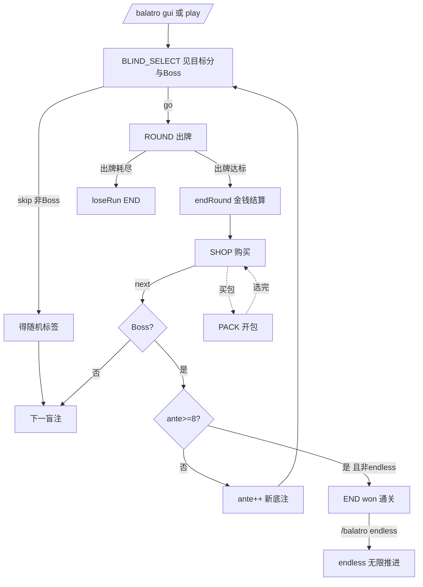

# 03 — 项目工作流分析

> 代码基线 v0.4.60（2026-08-17）。本报告覆盖两条线：**维护工作流**（这个仓库怎么开发、
> 验证、发版）与**业务工作流**（玩家视角一局游戏怎么走、引擎内关键决策树）。

## 一、维护工作流

### 1. 开发与版本发布工作流

无 CI/CD 配置（无 .github/workflows 等）。实际工作流由全局规约 + note 体系承载：


要点（源自 note/开发规范.md §9-11 与 note/README.md 约定）：

- **细粒度提交**：git log 显示单轮审计可含 3-6 笔提交（test/fix/docs 前缀+轮次号）。
- **发布说明四要素**：基线 / 改动 / 兼容性 / 验证（note/release/*.md 73 份均循此结构）。
- **版本注入链**：build.gradle.kts:6 → processResources expand → plugin.yml `${version}`
  → VersionInfo 运行时读取（防两处漂移，VersionInfo.java:7-9），并有
  PluginYmlConsistencyTest/VersionInfoTest 守门。

### 2. 测试工作流（四 battery 分区）

149 个测试文件按包分布：engine 131（根 87 / joker 23 / shop 13 / consumable 8）、
service 9、command 7、gui 2。按验证目标可分为四 battery（R178-R185 成形）：

| Battery | 覆盖 | 代表测试类 |
|---|---|---|
| 黄金（种子复现） | 13 个 golden txt 逐值断言，对照原版网页输出 | RngGoldenTest / EngineGoldenTest / EvalGoldenTest / DataGoldenTest 等 8 类 |
| Fuzz/混沌 | 守恒/边界/组合随机探索 | CardConservationFuzz / ScoringChaosFuzz / JointConservationFuzz / ShopPriceComboFuzz 等 9+ 类 |
| UI/服务/命令 | 帮助分页/悬停/配置一致性 | BalatroHelpPaginationTest / HoverTextTest / PluginYmlConsistencyTest / BenchScenarioDocConsistencyTest |
| engine 全域 | 机制/边界/新种子族 | 15 个 FreshSeed/FreshSmoke + Boss/挑战/无尽专项 |

**守门方法论**（note/审计方法学.md）：

- **类别锁**：把整类缺陷的失败面变成一个测试（如 RngStreamInventoryTest 锁流名集合
  与调用点计数、DescNameReferenceTest 锁 desc 引用实名）；每把锁必须**变异验证**
  （注入同类错误→红→还原→绿）。
- **黄金生成**：`tools/gen-golden.mjs` 在 Node vm 沙箱运行本地 REF 原版 JS 产出
  golden/*.txt；REF 更新后重生成对照。
- 表述-实现三向核对：代码 / golden / desc 文案三处同改。

### 3. 性能基准工作流

`benchmark/` 子项目（Gradle include，application main `cn.quotidietium.balatro.bench.Main`）：

- **11 场景**：rngNext/streamLookup/handEval/playHand/discard/roundCycle/shopGen/
  createRun/fullRun/useConsumable/packOpen（Scenarios.java:29-39；与 benchmark/README
  场景表有 BenchScenarioDocConsistencyTest 锁同步）。
- **协议**：每场景 3 预热+9 测量批（Main.java:27-28）；ns/op 用 System.nanoTime+
  ThreadMXBean 分配估算；Blackhole.SINK 防死码消除。
- **best-of-3 交错**：同代码连跑 3 个 label，`--aggregate` 取三次中位数的**最小值**
  （Main.java:81-135）——动机：共享机器噪声实测可达 ~36% 且只会使时间变大。
- **产物**：`benchmark/results/<label>/<scenario>.txt`（Properties 文本）入库作对比
  证据；`--compare` 打印 markdown 表+几何平均。基线锁定后不得改批量/种子/迭代参数。
- 三期战役战绩见 note/性能优化.md（几何 1.417×/1.393×/结构性减负）。

### 4. 审计工作流（本项目特色）

224 轮审计的标准化轮次结构（note/release/稳定性审计.md 全档）：

```
选题（审计镜头库）→ 读码/对照 REF → 发现 → 修复（或否证）
→ 回归测试（+变异验证）→ 发版（若改码）→ 细粒度 commit → 轮次章入档
```

- **镜头库**（note/审计方法学.md §三）：key→消费点→持有集合 / 撕裂点后第一个写入 /
  表述-实现三向核对 / 布局不变量提取 / 长局不变量 / 测试同源检审 等 7 类。
- **不变量**（§二）：命中盒宽≤行内间距 / 流名四层 / 数值三处同步 / 池化缓冲不逃逸 /
  静态池不可变 / 卡守恒真形 / 写面普查清单 等 9 条。
- 零缺陷轮的产出 = 类别锁或长局锁（不是空转）。

### 5. 实机验证工作流

`tools/live-bot/`（mineflayer 协议级假人，R220 建立）：

- check1-check20b 脚本化场景：牌桌生成/私有可见/点击链/种子复现/确认流/恶意输入/
  并发 soak（README.md:42-54）。
- 神谕手段：服务器侧 `/execute as @e` 实体计数（op 级真值）、状态变化断言
  （而非乐观计数）。
- 9 条踩坑规约沉淀（README）：offline UUID、**RCON 开启时 use_entity 全灭须关 RCON**、
  soak 断言以状态变化为准 等。
- 18 项清单 17 项通过（note/release/实机验证清单.md 执行记录表）；余 #18 真实客户端
  空间点击抽查。

## 二、业务工作流（玩家一局）

### 1. 全流程



### 2. 关键决策树

**出牌守卫链**（Engine.playHand，Engine.java:602-643）：

```
├── phase==ROUND? 否→err
├── handsLeft>0? 否→err
├── 1≤张数≤5? 否→err
├── id 查重（O(n²) 两两比较）? 重复→err
├── Boss 限制：psychic(须同型)/must5(须5张)/bell(须含铃牌)? 违→err
└── 通过 → 计分管线（见 02 报告 §4）
```

**回合金钱结算**（endRound，Engine.java:1062-1155）：

```
盲注奖励 reward（3/4/5 按 small/big/boss；终结者 $8；红注小盲归零；
  smallBigNoReward/Half/rewardMult/noBlindReward 挑战修饰）
+ 剩余出牌 handPay（绿色牌组特例=2*(hands+discards)）
+ 利息 min(interestCap, money/5 × doubleInterest?2:1)（noInterest 跳过）
+ 手中黄金牌每张 $3；蓝蜡封→最后出牌型的星球牌
+ onRoundEnd 钩子 payout（satAdd 防复利溢出）
− 租赁小丑每张 $3（money 直减可为负）；易腐归零 debuff
+ invest 标签（Boss 后 $25）
→ gainMoney(gain) 饱和累加
```

**购买决策点**（Shop.buyCard，Shop.java:449-478）：金钱够？→ joker 槽位
（negative 特例满槽可入）→ playing 牌入牌组 / 消耗品满槽退款 → 通胀 +1 →
recomputeFlags。

### 3. 业务规则量化（硬编码常量摘录）

| 常量 | 值 | 位置 |
|---|---|---|
| MAX_SEED_LEN | 32 | Rng.java:48 |
| 利息 | 每 $5 计 $1，上限 interestCap=5 | Engine.java:1097-1099 |
| 稀有度权重 | 70/25/5/0 | Data.Rarity（Data.java:546-558） |
| 商店重掷费 | $5+通胀−券减免 | Shop.java:514-517 |
| 交互节流 | 150ms | BoardListener.java:39 |
| 迁移阈值 | 64 格 | BoardMoveListener.java:22 |
| 统计上限 | 10000 条 | FileStats.java:32 |
| 奖励默认 | 清盲 $1/底注 $10/通关 $100 | config.yml:11-15 |
| 手牌临时溢出 | 上限+3（trimHand） | Consumables.java:397-404 |
| 幸运/玻璃/红蜡封概率 | 1/5、1/15、1/4 | Engine.java:935-944, 721 |

### 4. 异常恢复路径（业务面）

| 流程 | 失败点 | 恢复 | 位置 |
|---|---|---|---|
| 开局 | RunStart 被监听器取消 | 不入会话、回收牌桌 | SessionManager.java:45-58 |
| 开局 | 监听器递归再开局 | putIfAbsent 丢弃本局 | SessionManager.java:51-58 |
| 出牌 | 守卫拒绝 | PlayResult.err 文案返回，状态零变化 | Engine.java:602-643 |
| 购买 | 消耗品满槽 | 全额退款 | Shop.java:468-471 |
| 换血（ankh）/妖术（hex） | 改写小丑列表 | 使用后 recomputeFlags 防残留 | Consumables.java:70-73 |
| 牌桌跨区块半死 | 周边区块卸载 | update 自愈整体重建 | RoundBoard.java:226-238 |
| 服务器崩溃 | stats.txt 撕裂行 | 下次加载 compact 归一化 | FileStats.java:111-128 |
| 重启 | 全息实体 | 非持久+sweepStaleBoards 双保险 | BalatroPlugin.java:74-100 |
| 第三方监听器抛异常 | fire* 任意 | 记日志继续游戏流程 | BalatroPlugin.java:128-177 |

## 三、工作流级观察

1. **"手动 CI"成熟度高**：无持续集成服务，但每次发版的验证义务（全量测试+变异
   验证+实机清单回填）由 note 体系制度化，224 轮审计记录可追溯。
2. **验证分层清晰**：纯逻辑（JUnit 黄金/fuzz）→ 静态一致性（类别锁）→ 基准
   （best-of-3 交错）→ 实机（live-bot 协议级）——每层只测下一层测不了的东西。
3. **文档即测试基线**：note 的 release/perf/审计文档与代码有三向锁
   （BenchScenarioDocConsistencyTest 等），文档漂移会被测试抓到——这在该规模项目
   中罕见。
4. **决策留痕**：用户拍板项（如 6 处对 REF 的有意修正、R165 开放决策点）均在 note
   中标注依据与链接，可回溯。
